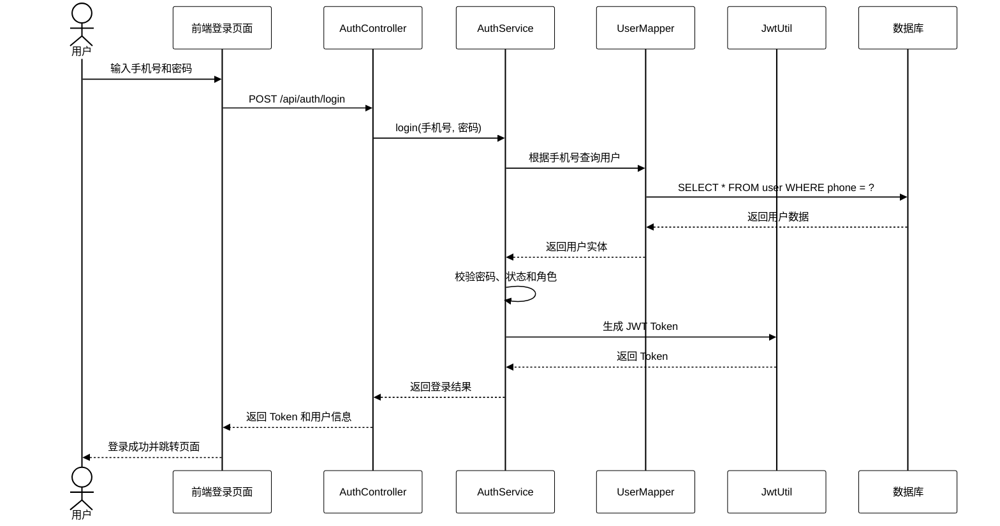
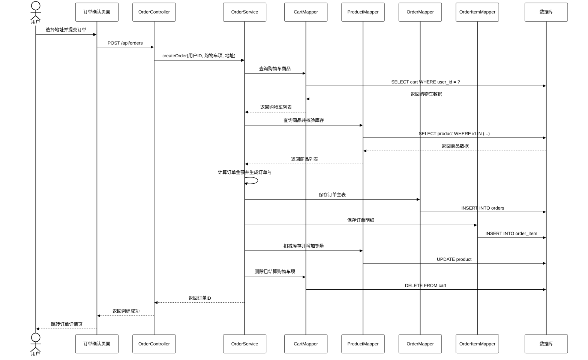
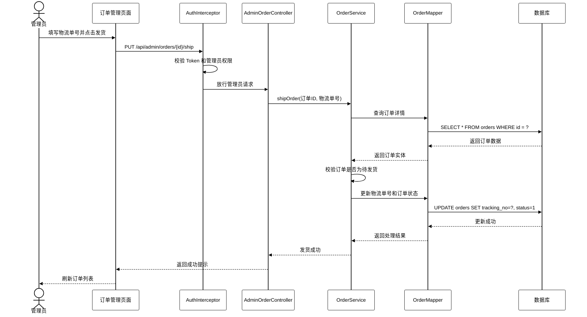

# 鲜渔小店时序图绘制说明

## 一、最快捷的方法

推荐使用 Mermaid 直接生成时序图，步骤如下：

1. 打开 Mermaid 在线编辑器：https://mermaid.live/
2. 将本文中的 Mermaid 代码复制进去。
3. 调整文字或参与对象名称。
4. 导出为 PNG 图片。
5. 将图片插入论文对应位置。

如果使用 draw.io、ProcessOn、Visio 手动画图，也可以按本文每个时序图的“绘制步骤”绘制。

论文中建议画 3 个时序图：

1. 用户登录时序图。
2. 用户下单时序图。
3. 管理员发货时序图。

这三个流程覆盖了系统中的认证、用户购物主流程和后台订单管理主流程，比较适合放在论文中。

## 二、用户登录时序图

### 1. 参与对象

从左到右依次画：

```text
用户
前端登录页面
AuthController
AuthService
UserMapper
JwtUtil
数据库
```

### 2. 绘制步骤

1. 用户在登录页面输入手机号和密码。
2. 前端登录页面向 `AuthController` 发送登录请求。
3. `AuthController` 调用 `AuthService` 处理登录逻辑。
4. `AuthService` 调用 `UserMapper` 根据手机号查询用户。
5. `UserMapper` 查询数据库并返回用户数据。
6. `AuthService` 判断用户是否存在、密码是否正确、账号是否启用。
7. 校验通过后，`AuthService` 调用 `JwtUtil` 生成 Token。
8. `AuthService` 将 Token 和用户信息返回给 `AuthController`。
9. `AuthController` 返回登录结果给前端。
10. 前端保存 Token 和用户信息，并根据用户角色跳转页面。

### 3. Mermaid 代码



## 三、用户下单时序图

### 1. 参与对象

从左到右依次画：

```text
用户
订单确认页面
OrderController
OrderService
CartMapper
ProductMapper
OrderMapper
OrderItemMapper
数据库
```

### 2. 绘制步骤

1. 用户在购物车选择商品后进入订单确认页面。
2. 用户选择收货地址并点击提交订单。
3. 前端订单确认页面向 `OrderController` 发送创建订单请求。
4. `OrderController` 获取当前登录用户信息，并调用 `OrderService`。
5. `OrderService` 查询购物车数据，校验购物车商品是否属于当前用户。
6. `OrderService` 查询商品数据，校验商品是否上架、库存是否充足。
7. 校验通过后，`OrderService` 创建订单主表数据。
8. `OrderService` 创建订单明细快照。
9. `OrderService` 扣减商品库存并增加销量。
10. `OrderService` 删除已结算的购物车项。
11. 事务提交后返回订单 ID。
12. 前端跳转订单详情页面。

### 3. Mermaid 代码



## 四、管理员发货时序图

### 1. 参与对象

从左到右依次画：

```text
管理员
订单管理页面
AdminOrderController
AuthInterceptor
OrderService
OrderMapper
数据库
```

### 2. 绘制步骤

1. 管理员登录后台并进入订单管理页面。
2. 管理员选择待发货订单，填写物流单号并点击发货。
3. 前端订单管理页面向后端发送发货请求。
4. `AuthInterceptor` 校验 Token 是否有效，并判断当前用户是否为管理员。
5. 权限校验通过后，请求进入 `AdminOrderController`。
6. `AdminOrderController` 调用 `OrderService` 处理发货业务。
7. `OrderService` 查询订单信息，判断订单是否为待发货状态。
8. 校验通过后，`OrderService` 更新物流单号和订单状态。
9. 数据库保存订单状态为待收货。
10. 后端返回发货成功，前端刷新订单列表。

### 3. Mermaid 代码



## 五、手动画图时的注意事项

如果你不用 Mermaid，而是在 draw.io、ProcessOn、Visio 里手动画，按下面规则画即可：

1. 顶部参与对象从左到右排列。
2. 每个参与对象下面画一条竖向虚线，表示生命周期。
3. 普通调用使用实线箭头，例如“提交登录请求”。
4. 返回结果使用虚线箭头，例如“返回用户数据”。
5. 需要体现后端权限校验时，可以把 `AuthInterceptor` 单独画出来。
6. 数据库查询和更新最好单独画到“数据库”对象上。
7. 下单流程要体现事务含义，可以在 `OrderService` 附近标注“事务处理”。
8. 论文里文字不要写太多，图下方可以写一句“图 x.x 用户下单时序图”。

## 六、论文推荐图名

可以在论文中这样命名：

```text
图2.x 用户登录时序图
图2.x 用户下单时序图
图2.x 管理员发货时序图
```

如果放在详细设计章节，也可以命名为：

```text
图4.x 用户登录时序图
图4.x 用户下单时序图
图4.x 管理员发货时序图
```
